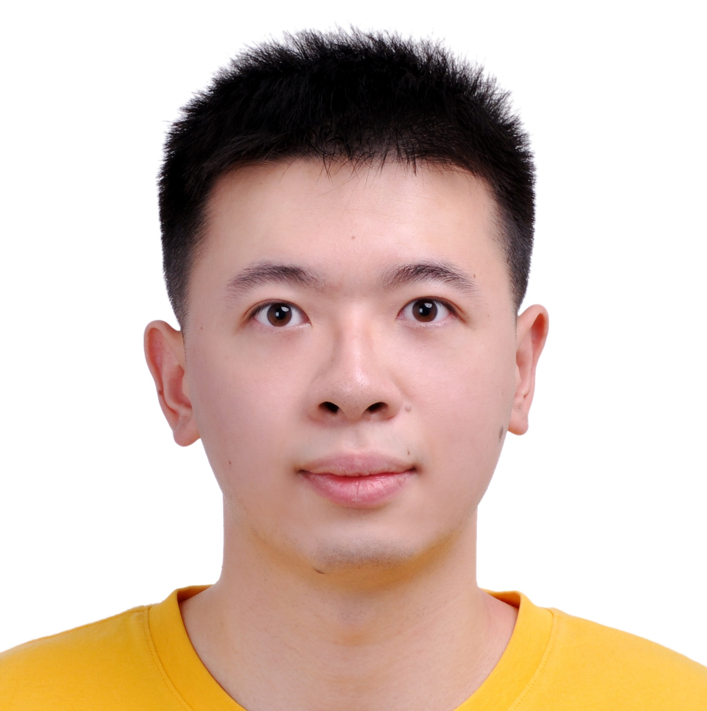

# Fuxiang Zhang (张福翔)

> **Telephone**: (+65) 8038-4459
>
> **Email**: zfx.agi@gmail.com
>
> **Address**: 2 Science Park Drive #01-08, Singapore 118222
> 
> **Homepage**: https://fuxiang-zhang.github.io

## Education Experiences

    <h3>Nanyang Technological University, Singapore, PhD Candidate</h3> 
  	Jan. 2025 - Present

I am a PhD candidate in the College of Computing and Data Science (CCDS), advised by Prof. [Bo An](https://personal.ntu.edu.sg/boan).

    <h3>Nanjing University, China, Master Graduate</h3> 
  	Sept. 2021 – Jun. 2024

I got my Master's degree in School of Artificial Intelligence, advised by Prof. [Zongzhang Zhang](https://www.lamda.nju.edu.cn/zhangzz/).

    <h3>Nanjing University, China, Bachelor's Degree</h3> 
  	Sept. 2017 – Jun. 2021

I got my Bachelor's degree in Department of Computer Science and Technology. 

## Work Experiences

    <h3>Skywork AI, Singapore, IPP Researcher</h3> 
  	Oct. 2024 - Present

I am in an industiral post-graduate program (IPP) with [Skywork AI](https://skywork.ai), a company focusing on AI and games.

    <h3>Tencent, China, Research Intern</h3> 
  	Jun. 2023 - Apr. 2024

I join the Tencent AI Lab Rhino-Bird Research Program and work on the intersection of reinforcement learning and foundation models for game AI. 

## Publication List

### Journal Papers

- **Fuxiang Zhang**, Junyou Li, Yi-Chen Li, Zongzhang Zhang, Yang Yu, Deheng Ye. Improving Sample Efficiency of Reinforcement Learning with Background Knowledge from Large Language Models. *IEEE Transactions on Neural Networks and Learning Systems (TNNLS)*, 2025.
- Lei Yuan, Lihe Li, Ziqian Zhang, **Fuxiang Zhang**, Cong Guan, Yang Yu. Multiagent Continual Coordination via Progressive Task Contextualization. *IEEE Transactions on Neural Networks and Learning Systems (TNNLS)*, 2025.
- Yi-Chen Li, Ningjing Chao, Zongzhang Zhang, **Fuxiang Zhang**, Lei Yuan, Yang Yu. Generalizable Multi-Modal Adversarial Imitation Learning for Non-Stationary Dynamics. *IEEE Transactions on Pattern Analysis and Machine Intelligence (TPAMI)*, 2025.
- Chengxing Jia\*, **Fuxiang Zhang**\*, Tian Xu, Jing-Cheng Pang, Zongzhang Zhang, and Yang Yu. Model Gradient: Unified Model and Policy Learning in Model-based Reinforcement Learning. *Frontiers of Computer Science*, 2024.

### Conference Papers

- **Fuxiang Zhang**, Jiacheng Xu, Chaojie Wang, Ce Cui, Yang Liu, Bo An. Incentivizing LLMs to Self-Verify Their Answers. *Conference on Neural Information Processing Systems (NeurIPS)*, 2025.
- Yi-Chen Li\*, **Fuxiang Zhang**\*, Wenjie Qiu, Lei Yuan, Chengxing Jia, Zongzhang Zhang, Yang Yu, Bo An. Q-Adapter: Customizing Pre-trained LLMs to New Preferences with Forgetting Mitigation. *International Conference on Learning Representations (ICLR)*, 2025.
- Chengxing Jia\*, **Fuxiang Zhang**\*, Yi-Chen Li, Chenxiao Gao, Xu-Hui Liu, Lei Yuan, Zongzhang Zhang, and Yang Yu. Disentangling Policy from Offline Task Representation Learning via Adversarial Data Augmentation. *International Conference on Autonomous Agents and Multiagent Systems (AAMAS)*, 2024.
- Chengxing Jia, Chenxiao Gao, Hao Yin, **Fuxiang Zhang**, Xiyao Chen, Tian Xu, Lei Yuan, Zongzhang Zhang, Zhi-Hua Zhou. Policy Rehearsing: Training Generalizable Policies for Reinforcement Learning. *International Conference on Learning Representations (ICLR)*, 2024.
- Jiacheng Xu, Chao Chen, **Fuxiang Zhang**, Lei Yuan, Zongzhang Zhang, Yang Yu. Internal Logical Induction for Pixel-Symbolic Reinforcement Learning. *ACM SIGKDD Conference on Knowledge Discovery and Data Mining (KDD)*, 2023.
- Yuhang Ran\*, Yi-Chen Li\*, **Fuxiang Zhang**, Zongzhang Zhang, and Yang Yu. Policy Regularization with Dataset Constraint for Offline Reinforcement Learning. *International Conference on Machine Learning (ICML)*, 2023.
- **Fuxiang Zhang**\*, Chengxing Jia\*, Yi-Chen Li, Lei Yuan, Yang Yu, Zongzhang Zhang. Discovering Generalizable Multi-agent Coordination Skills from Multi-task Offline Data. *International Conference on Learning Representations (ICLR)*, 2023.
- Lei Yuan, Chenghe Wang, Jianhao Wang, **Fuxiang Zhang**, Feng Chen, Cong Guan, Zongzhang Zhang, Chongjie Zhang, Yang Yu. Multi-Agent Concentrative Coordination with Decentralized Task Representation. *International Joint Conference on Artificial Intelligence (IJCAI)*, 2022.
- Feng Chen, Chenghe Wang, **Fuxiang Zhang**, Haotian Ding, Qiyu Zhong, Shi Pu, Zongzhang Zhang. Towards Deployment-Efficient and Collision-Free Multi-Agent Path Finding (Student Abstract). *AAAI Conference on Artificial Intelligence (AAAI), Student Abstract*, 2023.
- Lei Yuan\*, Jianhao Wang\*, **Fuxiang Zhang**\*, Chenghe Wang, Zongzhang Zhang, Yang Yu, and Chongjie Zhang. Multi-Agent Incentive Communication via Decentralized Teammate Modeling. *AAAI Conference on Artificial Intelligence (AAAI)*, 2022.

### Preprint Manuscripts

- Jujie He, Jiacai Liu, Chris Yuhao Liu, Rui Yan, Chaojie Wang, Peng Cheng, Xiaoyu Zhang, **Fuxiang Zhang**, Jiacheng Xu, Wei Shen, Siyuan Li, Liang Zeng, Tianwen Wei, Cheng Cheng, Bo An, Yang Liu, Yahui Zhou. Skywork Open Reasoner 1 Technical Report. *arXiv preprint*, 2025.
- Chris Yuhao Liu, Liang Zeng, Yuzhen Xiao, Jujie He, Jiacai Liu, Chaojie Wang, Rui Yan, Wei Shen, **Fuxiang Zhang**, Jiacheng Xu, Yang Liu, Yahui Zhou. Skywork-Reward-V2: Scaling Preference Data Curation via Human-AI Synergy. *Tech Report*, 2025.

*Note: \* denotes equal contribution.*
## Skills

- **Programming Languages:** Python, C++
- **Compute Arch**: Certificate of NVIDIA CUDA C/C++ development
- **English Proficiency**: TOEFL (99, R29, L22, S23, W25)

## Awards

- Second prize in CUMCM (Contemporary Undergraduate Mathematical Contest in Modeling), 2019
- Gold award in the 16th Algorithm Design Competition in Nanjing University
- Outstanding Graduate of Nanjing University in 2017 and 2023
